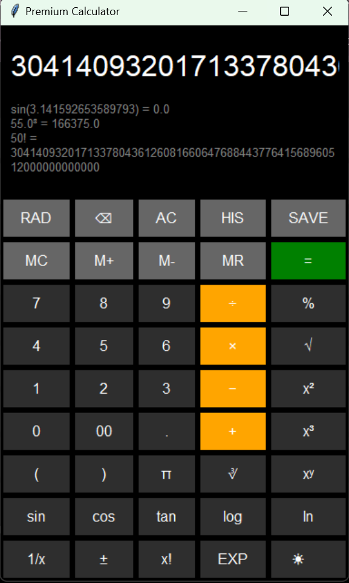
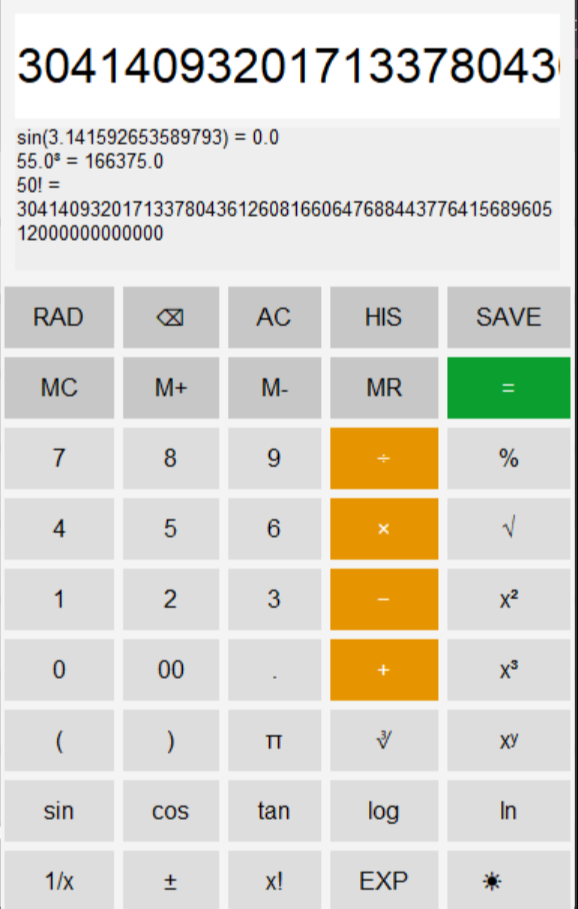
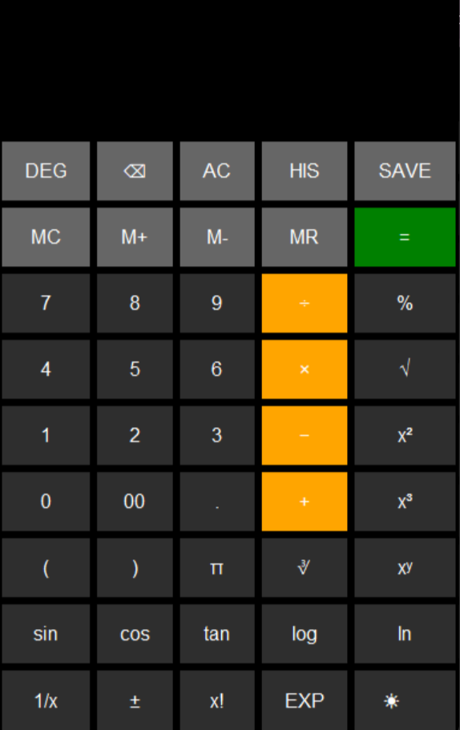

# Premium Scientific Calculator (Python)

A modern, feature-rich scientific calculator built using **Python (Tkinter)** and a fully functional **web version (HTML, CSS, JavaScript)**.

This project demonstrates strong fundamentals in **GUI development, frontend web development, and application packaging (EXE)** with a clean, premium user interface.

---

## Live Demo

[Open the Website Calculator](https://amberm1286-cyber.github.io/premium-calculator-python/)

---

## Demo

### Main Demo


### Light Mode


### UI Layout


---

## Features

### Basic Operations
- Addition (+)
- Subtraction (−)
- Multiplication (×)
- Division (÷)
- Double zero (00)
- Decimal (.)

---

### Scientific Functions
- sin, cos, tan (Degree & Radian support)
- log (base 10), ln (natural log)
- Square root (√)
- Cube root (∛)
- Power functions (x², x³, xʸ)
- Factorial (x!)
- Percentage (%)
- Pi (π)
- Sign toggle (±)
- Reciprocal (1/x)
- Exponential (eˣ)

---

### Memory System
- M+ → Add to memory
- M- → Subtract from memory
- MR → Recall memory
- MC → Clear memory

---

### History & File Support
- Scrollable history panel
- Stores all calculations
- Save history to a '.txt' file

---

### Keyboard Shortcuts

| Key | Action |
|-----|------|
| 0–9 | Numbers |
| + - * / | Operators |
| . | Decimal |
| ( ) | Brackets |
| Enter | Calculate |
| Backspace | Delete |
| Esc | Clear (AC) |
| S | sin |
| C | cos |
| T | tan |
| L | log |
| N | ln |
| R | √ |
| P | π |
| % | Percentage |
| ! | Factorial |

---

### UI/UX
- Premium dark theme
- Light/dark mode toggle
- Smooth hover animations
- Clean and responsive grid layout
- Responsive layout (mobile-friendly)

---

## Technologies Used
- **Python (Tkinter)** → Desktop GUI  
- **HTML, CSS, JavaScript** → Web version  
- **PyInstaller** → EXE packaging  

---

## Project Structure
- calculator_gui.py → Main Python calculator application  
- index.html → Website structure  
- style.css → Website styling  
- script.js → Website logic (calculator functionality)  
- history.txt → Saved calculation history (auto-generated)  
- main-demo.png → Main UI screenshot  
- light-mode.png → Light theme screenshot
- ui-layout.png → UI Layout screenshot
- icon.ico → Application icon for EXE  
- README.md → Project documentation

---

## How to Run

### Step 1: Install Python
Download from:
https://www.python.org

---

### Step 2: Open Folder
Go to the folder where your file is saved.

---

### Step 3: Run the Calculator

#### On Windows (Command Prompt / PowerShell):

```bash
python calculator_gui.py
OR
py calculator_gui.py
```

#### In VS Code:

1. Open the project folder
2. Open Terminal
3. Run:

```bash
python calculator_gui.py
```

#### Website Version

Open index.html in your browser or use the live demo link above.

#### Download (EXE)

- Download the latest version from Releases
1. Download ZIP
2. Extract files
3. Run .exe file

---

## Project Highlights

- Built both desktop and web versions
- Implemented scientific + memory + history system
- Created a downloadable EXE application
- Designed a modern UI with theme support
- Hosted live using GitHub Pages

---

## Author
- Amber Mahajan

--- 

## Future Improvements

- Android (APK) version
- Advanced math functions
- Graph plotting
- Voice input for desktop version
- Custom domain hosting


